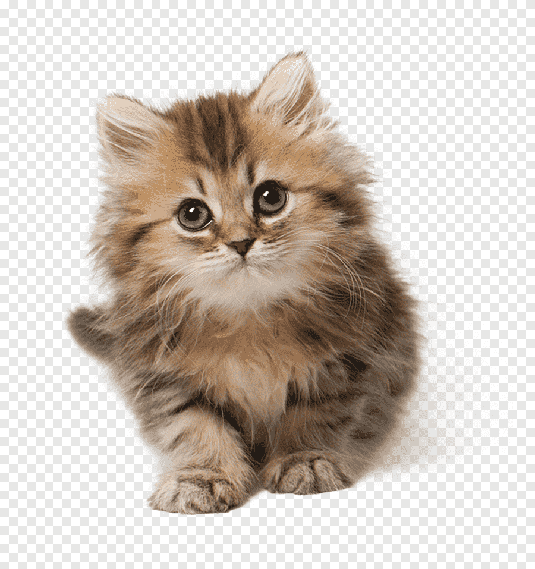

# Stepik_oo

***Kocham matematykę elementarną tftf***

~~No way~~

>> Ah jak przyjemnie to turek Camembert

1. Raz
2. Dwa
3. Trzy

- Ile
- Dałbym
- By zapomnieć cię

```py
a = "wszystkie chiwle te"
b = "które są na nie"
print(a,b)
```

Bo chcę `print("(bo chce)")` nie myśleć o tym już

